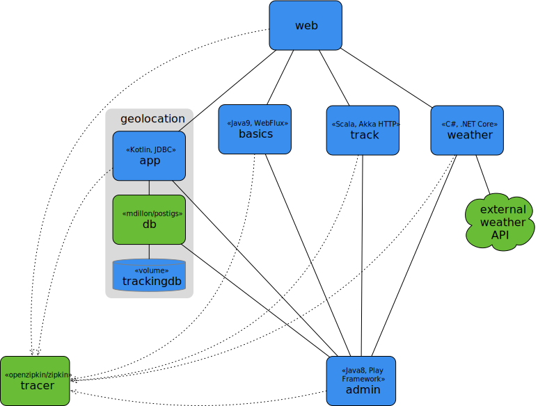

# Cloud experimentation

## [Web](web)
Typical web front end. It is a **Java 8** application that runs on **SpringMVC** and **Tomcat**. It makes use of the other services in this project.

## [Basics](basics)
Simple query service. It is a **Reactive Spring** service written in **Java 9** using **WebFlux**. The data it returns is based on Java internal libraries.

## [Weather](weather)
Proxies an external service to get weather reports for specific locations. It is written in **C#** and runs on **.NET Core**

## [Geolocation](geolocation)
Service that calculates which geographic areas cover a coordinate. It is a **Kotlin** application built on **Spring JDBC**, and accesses a **PostGIS** database.

## [Track](track)
Tracks geographic observations over time. It is written in **Scala** and built on **Akka HTTP**.

## [Administration](admin)
Administer and explore the other services. It is a **Java 8** application built on the **Play Framework**.

